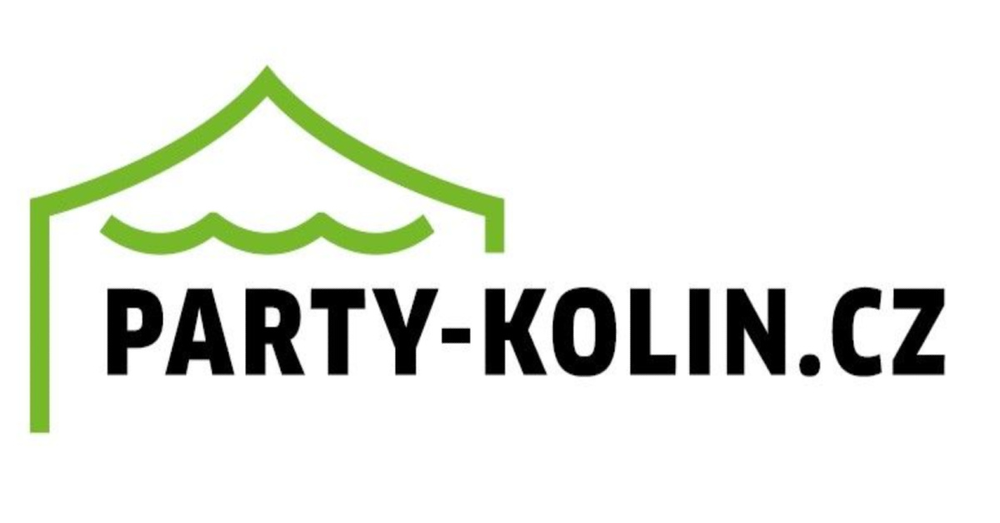
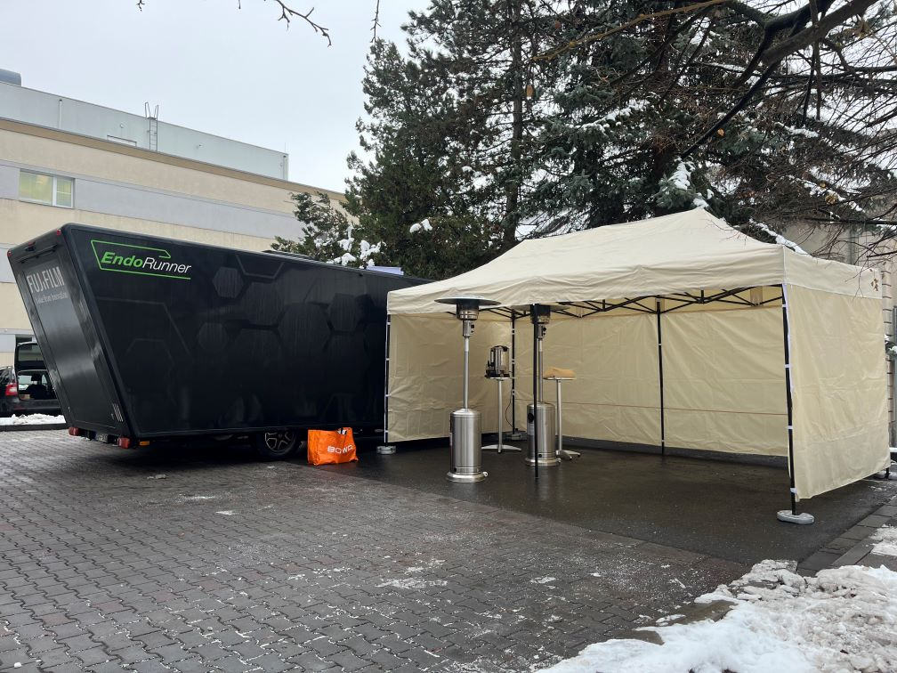
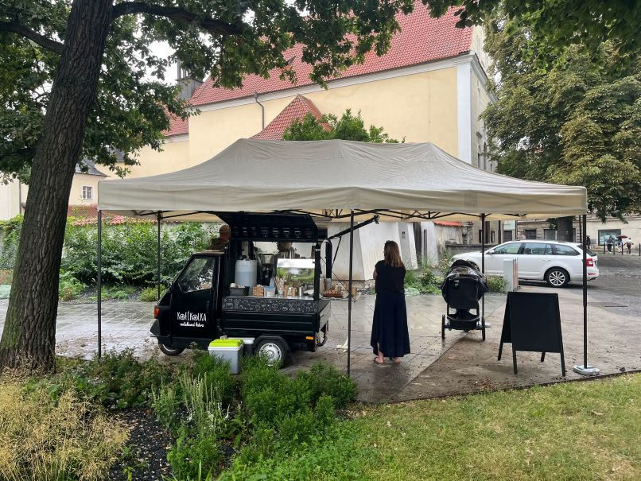

<!DOCTYPE html>
<html lang="cs">
<head>
    <meta charset="UTF-8">
    <meta name="viewport" content="width=device-width, initial-scale=1.0, maximum-scale=1.0, user-scalable=no">
    
    <title>Party Kolín | Půjčovna párty stanů, skákacích hradů a vybavení</title>
    <meta name="description" content="Půjčovna vybavení pro vaši oslavu v Kolíně a okolí. Nabízíme párty stany 6x12m a 3x6m, skákací hrady, pivní sety s luxusními povlaky, plynové hřiby, rautové a barové stoly. Kompletní servis včetně montáže a dopravy.">
    <meta name="keywords" content="půjčovna stanů Kolín, párty stan 6x12, nůžkový stan, skákací hrad Kolín, pivní sety, plynový hřib, rautové stoly, barové stolky, oslavy Kolín, svatba venku">
    <meta name="author" content="Miloš Hulinko">

    <meta property="og:title" content="Party Kolín | ...s námi to oslavíte">
    <meta property="og:description" content="Vše pro vaši párty na jednom místě. Stany, hrady, posezení i topení v Kolíně a okolí.">
    <meta property="og:image" content="logo.jpg">
    <meta property="og:type" content="website">

    <link href="https://fonts.googleapis.com/css2?family=Inter:wght@300;400;600;700&display=swap" rel="stylesheet">
    
</head>
<body>

    <nav>
        
        

            <a href="#sluzby">Naše služby</a>
            <a href="#vybaveni">Ceník</a>
            <a href="#galerie">Galerie</a>
            <a href="#faq">Časté dotazy</a>
            <a href="#podminky">Podmínky</a>
            <a href="#kontakt">Kontakt</a>
        

    </nav>

    <header class="hero">
        <h1>...s námi to oslavíte.</h1>
    </header>

   <section id="sluzby" style="background: #fcfcfc; padding: 80px 0;">
        

            

                Půjčovna s lidským přístupem
                <h2 style="margin-top: 10px;">...s námi to oslavíte v klidu</h2>
                

            

            

                

                    

                        Nenechte počasí diktovat pravidla vaší párty!
                    

                    

                        Plánujete svatbu, rodinné výročí nebo tu nejlepší narozeninovou oslavu pod širým nebem? Máte vybrané jídlo, pozvané hosty a vyladěný každý detail, ale jedna věc vás straší – počasí. My v <strong>Párty Kolín</strong> jsme tu od toho, abychom tuhle nejistotu vymazali z vašeho seznamu starostí.
                    

                

                

                    

                        <h3 style="color: var(--primary-color); margin-top: 0;">Kdo jsme?</h3>
                        
Jsme dva bratranci z Kolína, kteří věří, že každá oslava si zaslouží být perfektní, ať už venku praží slunce, fouká vítr nebo padají trakaře. Nejsme anonymní půjčovna – zakládáme si na lidském přístupu a 100% spolehlivosti.

                    

                

                <h3 style="text-align: center; margin-bottom: 30px; font-size: 1.6rem;">Co pro vás máme připraveno?</h3>
                

                    
                    

                        <h4 style="margin: 0 0 10px 0; color: var(--text-dark);">⛺ Párty stany</h4>
                        

                            Pro velké události (svatby, firemní akce) máme prostorný <strong>trubkový stan 6x12 m</strong>. Pro menší setkání nabízíme <strong>rychlý nůžkový stan 6x3 m</strong>, který stojí doslova za pár minut.
                        

                    

                    

                        <h4 style="margin: 0 0 10px 0; color: var(--text-dark);">☕ Komfort a teplo</h4>
                        

                            Zajistíme klasické pivní sety pro pohodlné sezení. A pokud se oslava protáhne do chladného večera? Naše <strong>plynové vytápění</strong> zajistí, že nikdo nebude muset sahat po dece.
                        

                    

                    

                        <h4 style="margin: 0 0 10px 0; color: var(--text-dark);">🏰 Dětský ráj</h4>
                        

                            Naše <strong>skákací hrady</strong> zabaví ty nejmenší na dlouhé hodiny, zatímco vy si můžete v klidu užít kávu nebo drink. Bezpečná zábava, která k rodinné akci patří.
                        

                    

                

                

                    <h3 style="margin-bottom: 15px;">Proč jít do toho s námi?</h3>
                    

                        "Protože nás to baví. Zakládáme si na tom, že naše vybavení je vždy čisté, funkční a že domluva s námi prostě platí. Vaši radost ze srazu s blízkými nenecháme zmoknout."
                    

                

            

        

    </section>
 
    <section id="vybaveni" class="container">
        

            <h2>Vybavení & Ceník</h2>
            

        

        

            

                

                

                    <h3>Párty stan 6 x 12 m</h3>
                    <ul class="card-list">
                        <li>Kapacita 50 až 80 osob</li>
                        <li>Výška boční stěny 2m / střechy 3m</li>
                        <li>Stabilní PVC plachta a konstrukce</li>
                        <li>V ceně montáž a doprava do 10km</li>
                    </ul>
                    
10 890 Kč s DPH

                    
Cena za 1 až 2 dny zapůjčení

                    <a href="#kontakt" class="btn-main">POPTAT TERMÍN</a>
                

            

            

                

                

                    <h3>Nůžkový stan 3 x 6 m</h3>
                    <ul class="card-list">
                        <li>Pro cca 20 osob (3 pivní sety)</li>
                        <li>3x bok, 1 strana otevřená</li>
                        <li>Postavení do 5 minut</li>
                        <li>Stabilní konstrukce</li>
                    </ul>
                    
1 900 Kč s DPH

                    
Cena za 1 až 2 dny zapůjčení

                    <a href="#kontakt" class="btn-main">POPTAT TERMÍN</a>
                

            

            

                

                

                    <h3>Pivní set (2x lavice + stůl)</h3>
                    <ul class="card-list">
                        <li>Pro 6 až 8 osob, stabilní provedení</li>
                        <li>Samostatně od 4ks</li>
                        <li>Jinak pouze ke stanům</li>
                    </ul>
                    
330 Kč s DPH

                    
Cena za 1 až 2 dny zapůjčení

                    <a href="#kontakt" class="btn-main">POPTAT TERMÍN</a>
                

            

            

                

                

                    <h3>Povlak na pivní set 200x50</h3>
                    <ul class="card-list">
                        <li>Povlak na 2 lavice a stůl</li>
                        <li>Molitanová výstelka lavic</li>
                        <li>Luxusní měkké posezení</li>
                        <li>Půjčujeme od 4ks</li>
                    </ul>
                    
390 Kč s DPH

                    
Cena za 1 až 2 dny zapůjčení

                    <a href="#kontakt" class="btn-main">POPTAT TERMÍN</a>
                

            

            

                

                

                    <h3>Vytápění (plynový hřib)</h3>
                    <ul class="card-list">
                        <li>Výkon 10kW (provoz až 13h)</li>
                        <li>Vytápění stanu nebo okolí</li>
                        <li>Cena s 10kg PB: 1550 Kč s DPH</li>
                        <li>Samostatně po domluvě</li>
                    </ul>
                    
770 Kč / bez náplně

                    
Cena za 1 až 2 dny zapůjčení

                    <a href="#kontakt" class="btn-main">POPTAT TERMÍN</a>
                

            

            

                

                

                    <h3>Rautový stůl 180 cm</h3>
                    <ul class="card-list">
                        <li>Rozměr: 180 x 74 x 75 cm</li>
                        <li>Vnitřní i venkovní použití</li>
                        <li>Možnost potahu (+180 Kč s DPH)</li>
                        <li>Půjčujeme pouze se stany</li>
                    </ul>
                    
245 Kč s DPH

                    
Cena za 1 až 2 dny zapůjčení

                    <a href="#kontakt" class="btn-main">POPTAT TERMÍN</a>
                

            

            

                

                

                    <h3>Barový kulatý stůl</h3>
                    <ul class="card-list">
                        <li>ø 60 cm, výška 110 cm</li>
                        <li>Sklopná deska, stavitelné nohy</li>
                        <li>Možnost potahu (+150 Kč)</li>
                        <li>Samostatně po domluvě</li>
                    </ul>
                    
245 Kč s DPH

                    
Cena za 1 až 2 dny zapůjčení

                    <a href="#kontakt" class="btn-main">POPTAT TERMÍN</a>
                

            

            

                

                

                    <h3>Hrad House 3v1</h3>
                    <ul class="card-list">
                        <li>4,55 x 3,30 x 2,65 m</li>
                        <li>Max. 6 dětí, nosnost 180kg</li>
                        <li>Atest TÜV, boční sítě</li>
                        <li>Věk dětí 3 až 10 let</li>
                    </ul>
                    
1 500 Kč / 24 hod.

                    
Hmotnost jednotlivce max 45kg

                    <a href="#kontakt" class="btn-main">POPTAT TERMÍN</a>
                

            

            

                

                

                    <h3>Hrad Obří skluzavka</h3>
                    <ul class="card-list">
                        <li>5,60 x 2,55 x 1,90 m</li>
                        <li>Max. 4 děti, nosnost 180kg</li>
                        <li>Atest TÜV, fukar v ceně</li>
                        <li>Věk dětí 3 až 10 let</li>
                    </ul>
                    
1 500 Kč / 24 hod.

                    
Hmotnost jednotlivce max 45kg

                    <a href="#kontakt" class="btn-main">POPTAT TERMÍN</a>
                

            

            

                

                

                    <h3>Hrad Překážková dráha</h3>
                    <ul class="card-list">
                        <li>5,60 x 2,55 x 1,90 m</li>
                        <li>Max. 4 děti, nosnost 180kg</li>
                        <li>Atest TÜV, váha 30kg</li>
                        <li>Věk dětí 3 až 10 let</li>
                    </ul>
                    
1 500 Kč / 24 hod.

                    
Hmotnost jednotlivce max 45kg

                    <a href="#kontakt" class="btn-main">POPTAT TERMÍN</a>
                

            

          
      

                

                

                    <h3>Hrad Překážková dráha</h3>
                    <ul class="card-list">
                        <li>5,60 x 2,55 x 1,90 m</li>
                        <li>Max. 4 děti, nosnost 180kg</li>
                        <li>Atest TÜV, váha 30kg</li>
                        <li>Věk dětí 3 až 10 let</li>
                    </ul>
                    
1 500 Kč / 24 hod.

                    
Hmotnost jednotlivce max 45kg

                    <a href="#kontakt" class="btn-main">POPTAT TERMÍN</a>
                

            

            

                

                

                    <h3>Osvětlení stanu</h3>
                    <ul class="card-list">
                        <li>2x halogenový nebo LED reflektor</li>
                        <li>Světelný výkon ekv. 3200lm</li>
                        <li>Kabel 15m nebo 20m (dle stanu)</li>
                        <li>Půjčujeme pouze se stany</li>
                    </ul>
                    
390 Kč / 1 až 2 dny

                    
Cena včetně montáže a demontáže

                    <a href="#kontakt" class="btn-main">POPTAT TERMÍN</a>
                

            

            

                

                

                    <h3>Doprava a závoz</h3>
                    <ul class="card-list">
                        <li><strong>Stan 6x12m: do 10km ZDARMA</strong></li>
                        <li>Ostatní: individuální kalkulace</li>
                        <li>Dle velikosti zakázky a vzdálenosti</li>
                        <li>Závoz v rámci Kolína a okolí</li>
                    </ul>
                    
Individuálně / dle cesty

                    
Cenu vám upřesníme v nabídce

                    <a href="#kontakt" class="btn-main">POPTAT TERMÍN</a>
                

            

        
 </section> <section id="galerie" class="container" style="background: #fafafa; max-width: 100%;">

    <section id="galerie" class="container" style="background: #fafafa; max-width: 100%;">
        

            <h2>Galerie našich realizací</h2>
            

        

        

            <button class="filter-btn active" data-filter="all">Vše</button>
            <button class="filter-btn" data-filter="stan6x12">Stan 6x12m</button>
            <button class="filter-btn" data-filter="nuzkovy">Nůžkový stan</button>
            <button class="filter-btn" data-filter="hrady">Skákací hrady</button>
            <button class="filter-btn" data-filter="ostatni">Ostatní</button>
        

        

            

            

            

            

            

            

            

            

            

            

            

            

            

            

            

            

            

            

            

            

            

            

            

            

            

            

            

            

            

            

            

            

            

            

            

            

            

            

            

            

        

    </section>

   <section id="faq" class="container" style="background: #fff;">
        

            <h2>Časté dotazy</h2>
            

        

        

            
            

                <h3 style="color: var(--primary-color); border-bottom: 2px solid var(--border-color); padding-bottom: 10px; margin-bottom: 20px;">📌 Obecné informace</h3>
                
                

                    <h4>Jak objednat zápůjčku (pronájem)?</h4>
                    
Kontaktujte nás přes email nebo kontaktní formulář a sdělte nám, co byste z výčtu vybavení potřebovali zapůjčit a také na jaké období. V odpovědi Vám potvrdíme dostupnost vybavení. V ten moment nepřijmeme další požadavek od jiných zájemců, dokud u Vás nebudeme mít jasno, zda máte zájem či nikoliv. V dalších krocích komunikace přejdeme od nabídky až po případné potvrzení Vaší objednávky.

                

                

                    <h4>Jak vzniká obchodní vztah (smlouva o pronájmu)?</h4>
                    
1) Potvrzením nabídky zájemcem elektronicky (závazná objednávka), kde zároveň zájemce souhlasí s Obchodními podmínkami. 
                       2) Podpisem papírové Smlouvy o pronájmu při předání předmětu nájmu.

                

                

                    <h4>Kde je možné zápůjčku vyzvednout?</h4>
                    
Jelikož nemáme žádné oficiální výdejní místo, stany a další vybavení Vám <strong>přivezeme na místo určení</strong>, kde Vám stan(y) rovnou postavíme. Dětský skákací hrad Vám buď také přivezeme, nebo se domluvíme na místě předání.

                

            

            

                <h3 style="color: var(--primary-color); border-bottom: 2px solid var(--border-color); padding-bottom: 10px; margin-bottom: 20px;">⛺ Párty stany</h3>
                
                

                    <h4>Mohu si párty stan + příslušenství postavit sám/sama?</h4>
                    
Bohužel to není možné. Stany půjčujeme <strong>pouze se stavbou od nás</strong>, z důvodů kontroly stavu při navrácení a také proto, že stavba velkého stanu vyžaduje zkušenosti a přesný postup.

                

                

                    <h4>Jak velké místo budu pro stan či hrad potřebovat?</h4>
                    
Pro párty stan je třeba počítat s <strong>3 m navíc</strong> oproti psaným rozměrům na každou stranu stanu. Na výšku stan potřebuje cca 3 m prostoru. Skákací hrad potřebuje rovněž min. 3 m odstup na každou stranu.

                

                

                    <h4>Na jakém místě lze párty stan postavit?</h4>
                    
Je třeba <strong>měkký podklad (tráva, hlína)</strong>, aby stan bylo možno řádně ukotvit, popř. podklad, do kterého lze navrtat kotvící turbo šrouby. Stavba na jiný podklad (beton, dlažba) je možná pouze po předchozí domluvě.

                

            

            

                <h3 style="color: var(--primary-color); border-bottom: 2px solid var(--border-color); padding-bottom: 10px; margin-bottom: 20px;">🏰 Dětské skákací hrady</h3>
                
                

                    <h4>Zvládnu hrad rozbalit a nafouknout sám?</h4>
                    
Ano, hrad postavíte během pár minut. Stačí zkontrolovat plochu (bez ostrých nečistot), rozložit podkladovou plachtu a na ní hrad roztáhnout. Poté nasadíte rukáv hradu na kompresor, zajistíte suchým zipem a zapojíte do sítě. Hrad se do minut
